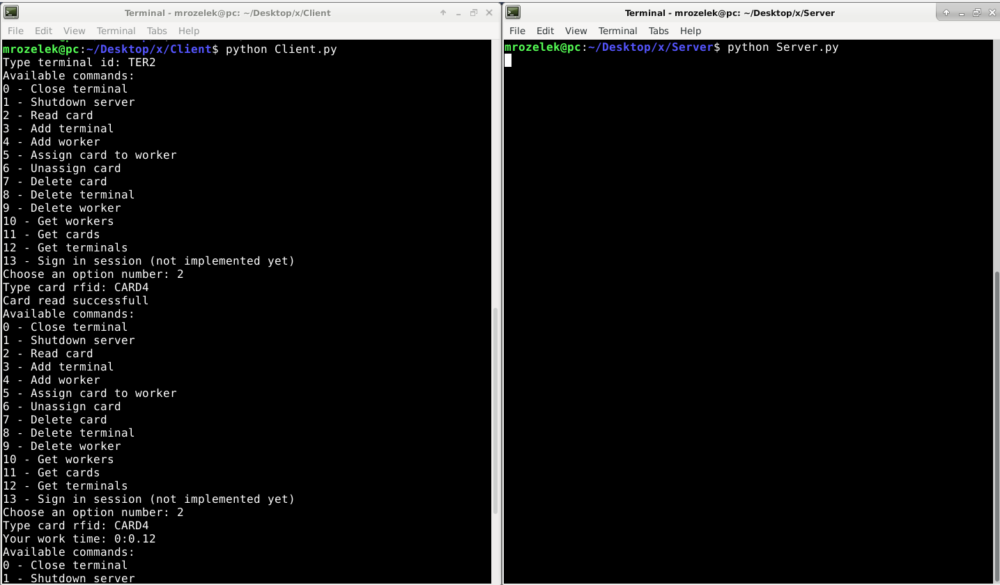
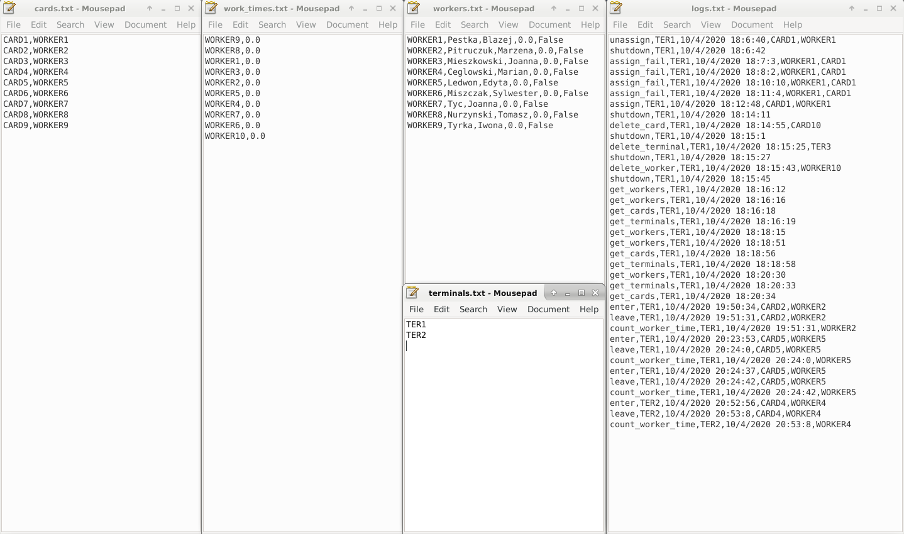

# RFID Scanner Simulator with MQTT data transfer
A simple console simulation of raspberry pi's RFID cards scanner with MQTT data transfer feature.  
Program has been written in python and bash for Internet of Things course at Wroclaw University of Science and Technology.

## Table of content
* [General info](#general-info)
* [Screenshots](#screenshots)
* [Technologies](#technologies)
* [Setup](#setup)
* [Code Examples](#code-examples)
* [Features](#features)
* [Changelog](#changelog)
* [Contact](#contact)

## General info
Program tested on windows 10 system. 
You can be notified with available commands after typing 'help' command in console. Defaultly there are 3 terminals (TER1, TER2, TER3),
10 new workers without work time and they are assigned to 10 cards. Also you are assigned to the TER2.  
You can change your terminal, login and password in "Constant.py" file in ServerPckg and ClientPckg folders.  
Program's main role is to count a work time of every worker who have used the rfid card to enter and exit.

## Screenshots

## Technologies
* Python 3
* Mosquitto MQTT Broker

## Setup
1. Download [Mosquitto](https://mosquitto.org/download/) broker to your PC.  
2. Generate authentication keys. To do so proceed to cmd, change directory to the one where you would like to have keys and use following commands (you don't need to type in anything more beside of pass phrases, just skip the rest with *enter* key):
- openssl genrsa -des3 -out ca.key 2048
- openssl req -new -x509 -days 1826 -key ca.key -out ca.crt
- openssl genrsa -out server.key 2048
For the next one, you will need to type in your *hostname* in *Common Name*.
- openssl req -new -out server.csr -key server.key
- openssl x509 -req -in server.csr -CA ca.crt -CAkey ca.key -CAcreateserial -out server.crt -days 360
3. In mosquitto broker directory create new directory named *certs* and copy there generated *ca.crt*, *server.crt* and *server.key* files.

## Code examples
`2`  
`CARD2`  
\> Card read successfully  
`2`  
`CARD2`  
\> Your work time: 0:0.57

## Features
List of features ready:
* Read card (includes adding new card, changing worker state and printing worker's time)
* Delete or add terminal, card or worker
* Print list of terminals, cards or workers
* Assign or unassign card and reader
* Shutdown server remotely
* Shutdown terminal
* Writing and reading server backup on startup and shutdown, based on *.txt files
* Writing all of activities done on server to *logs.txt* file

To-do list:
* Switch from data in files to database (SQLite)

## Changelog
- v. 3 - Code refactor. Database separated from Server. Separated constants, common functions and main.  
Client and Server now need cert files to connect to broker. Client and Server have to use login and password.
- v. 2 - Split project from one console where client and server was to use MQTT in several consoles (server and multiple terminals).  
Client's methods and method of doing backups hasn't been changed.  
Terminal's class has been deleted from server's database and moved as another solution.  
Moved project from windows to linux and fixed some compability issues.
- v. 1 - Initial project

## Contact
Created by **Jędrzej Ratajczak** ([@mrozelek](https://github.com/Mrozelek)) - feel free to contact me!
